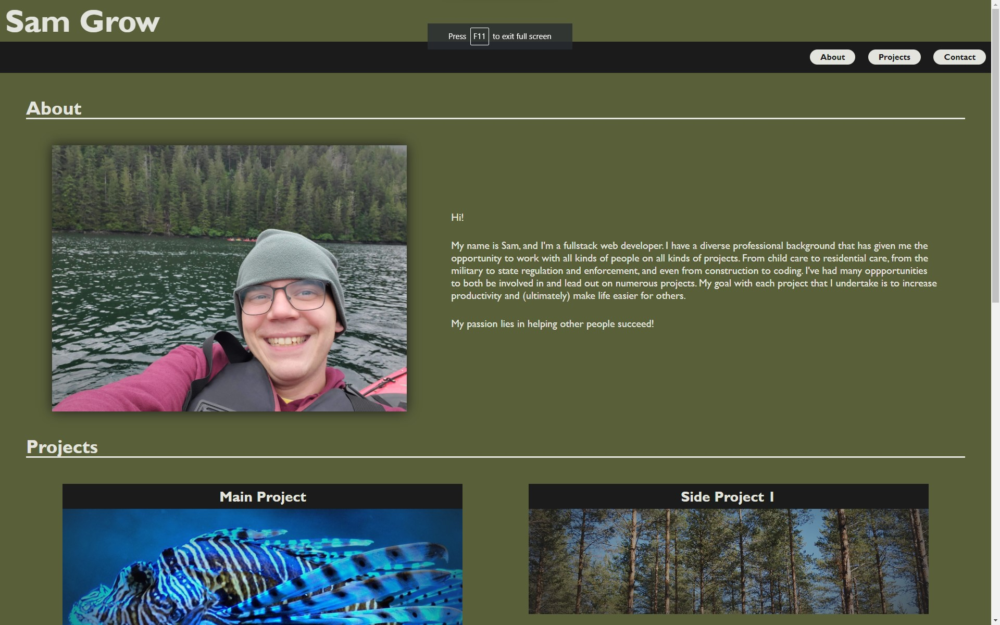

# Student Portfolio - Sam Grow (2024)

## Description

This portfolio was created to provide a central location where I can display my completed and in-progress work. This was designed to be avialable to the public, though it's primary purpose is to be used as part of my professional resume when applying for work in the coding field.

## Usage

This webpage is live and can be accessed at: https://honeybuzz94.github.io/portfolio_2024/

## Credits

There were no collaborators on this project.

The following resources were used to assist with the development of this project:

* [w3schools](https://www.w3schools.com)
* [w3docs](https://www.w3docs.com/snippets/html/how-to-create-an-html-button-that-acts-like-a-link.html)
* [Tony Teaches Tech](https://www.youtube.com/watch?v=xHFzQ8QRjGU)
* [HubSpot](https://blog.hubspot.com/marketing/jump-link-same-page)

Placeholder images were acquired from Google image search using images with a creative commons license.
---